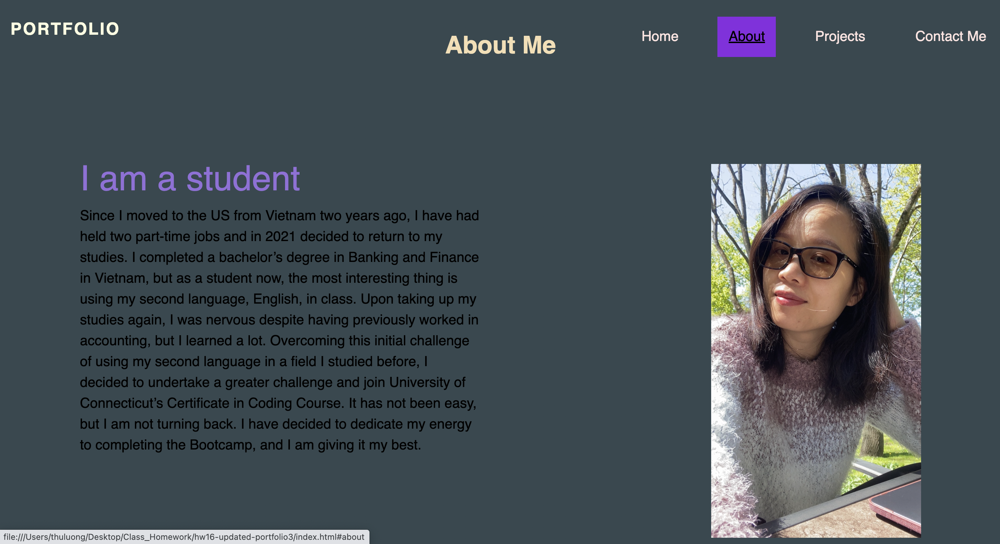
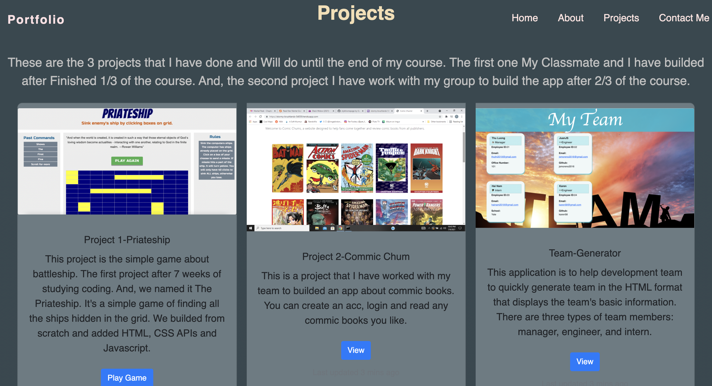
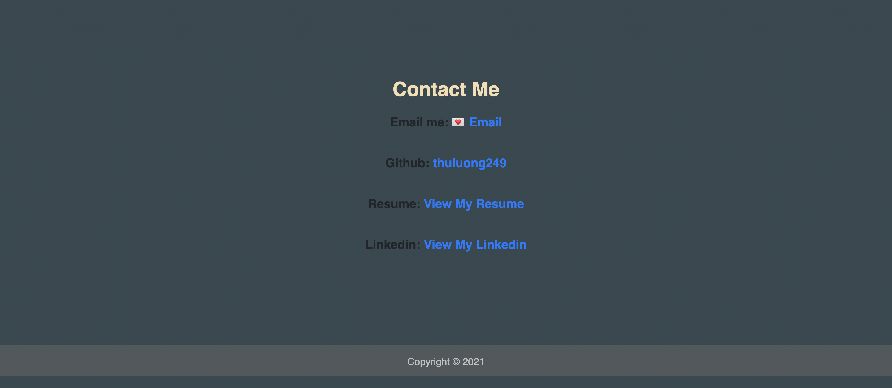

# hw16-updated-portfolio3 👩‍💻

# 📝🔖 Description 📝🔖

👩‍💻 This homework I modified from the first homework I have build before. 

👩‍💻 I have been using Bootstrap in this asignment, using the color that I have found on google.com not only from bootstrap. 

👩‍💻 Updated all the page and added my full name, email and phone numbers. Added the links to the first project I have created with my classmates plus the other two homeworks from my github page. 

👩‍💻 For the Github page I have updated with pinned the repositories for the page. Added profile picture, Bio, current location, email and link to my deployed Portfolio page.

👩‍💻 Customize the size of the page for viewing on a different devices. 

👩‍💻 Biside I have updated my resume and Linkedin, links them to the Portfolio page.

# 🔗 Link

- [Updated-Portfolio](https://thuluong249.github.io/hw16-updated-portfolio3/)

# 📸 Screenshot 📸

Home page 

---

About Me 

---

Projects

---

Contact info

---

# Questions

If you have any questions, here is a link to my github as well as my email address. Feel free to contanct me!

* [Github](https://github.com/thuluong249)

* <a href="mailto:thujtn2019@gmmail.com">💌 Email</a> 

